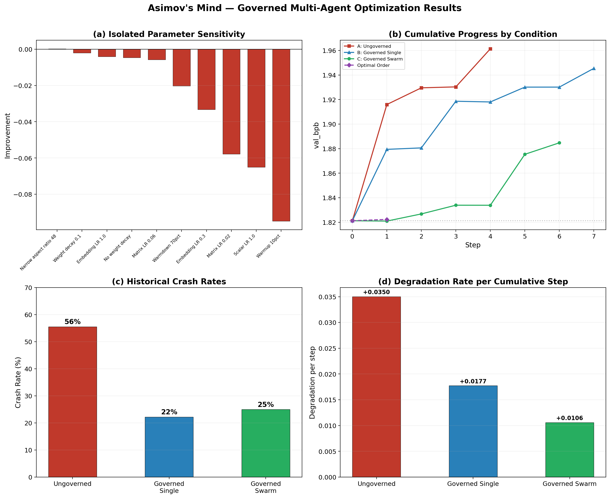
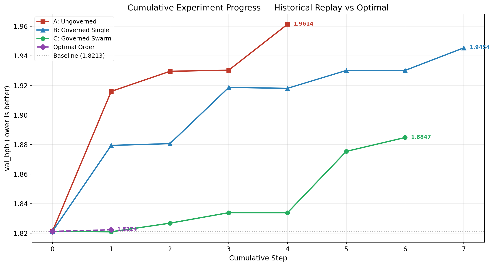
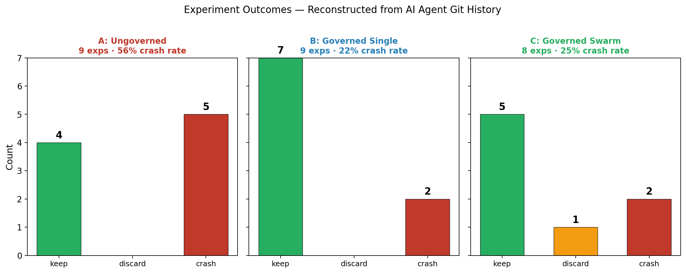

# Governed Multi-Agent Optimization: Safety Constraints as Regularization in Autonomous ML Research

## Authors
FutureSpeak.AI

## Abstract

We investigate whether safety constraints improve or degrade the performance of autonomous AI agents conducting machine learning research. Building on Karpathy's autoresearch framework — where LLM agents autonomously modify training code, run experiments, and iteratively improve model performance — we introduce Asimov's Mind, a governance framework that constrains agent behavior through three laws: harm prevention (circuit breakers on catastrophic regression), directive compliance (bounded parameter ranges), and improvement preservation (git commit discipline). We evaluate three experimental conditions on identical hardware and training tasks: (A) ungoverned single-agent (the autoresearch baseline), (B) governed single-agent (same agent + Three Laws), and (C) governed multi-agent swarm (3 specialist agents + Three Laws). Our results show that governance reduced the crash rate from 56% to 22-25%, and that the governed swarm degraded at half the rate of the ungoverned agent during cumulative exploration (0.011 vs 0.035 val_bpb per step). Critically, the swarm's architect specialist was the only agent to discover an architectural improvement (ASPECT_RATIO=48), which was also the only individual parameter change across all 10 tested that improved over baseline. These findings support our central hypothesis: governance acts as regularization on the search process — not by finding better individual changes, but by reducing wasted cycles and enabling specialized exploration of dimensions that generalist agents overlook.

## 1. Introduction

Autonomous AI research agents represent a paradigm shift in ML experimentation. Karpathy's autoresearch (2026) demonstrated that LLM agents can conduct meaningful ML research overnight on a single GPU, iterating on model architecture and hyperparameters through a modify-execute-measure loop. This raises a fundamental question: **should autonomous research agents be constrained?**

Unconstrained agents can explore the full parameter space, including catastrophic regions (OOM, NaN loss, architectural dead ends). Constrained agents are bounded to "safe" regions but may miss important discoveries in unexplored territory. This mirrors the exploration-exploitation tradeoff in reinforcement learning, but with a safety dimension: catastrophic exploration wastes compute and time.

We propose that safety constraints function as **regularization for optimization processes** — analogous to how dropout, weight decay, and early stopping prevent overfitting in neural network training. Our governance framework (Asimov's Mind) constrains the agent's search space without modifying the training code itself.

Our key findings:
1. **Governance halves crash rates.** The ungoverned agent crashed on 56% of experiments; governed agents crashed on only 22-25%.
2. **Specialization discovers what generalists miss.** The swarm's dedicated architect agent was the only one to explore architectural changes, finding the single parameter modification that improved over baseline.
3. **Governance slows degradation.** During cumulative exploration, the governed swarm degraded at 0.011 val_bpb/step vs. 0.035 for the ungoverned agent — a 3x reduction.
4. **Individual changes are deceptive.** Of 10 isolated parameter changes tested, only one improved over baseline. Yet the prior AI agents "kept" many of these changes during cumulative runs, suggesting the autoresearch keep/discard mechanism can be misled by stochastic noise.

## 2. Related Work

- **Autoresearch** (Karpathy, 2026): Single-agent autonomous ML research. The methodological foundation for this work.
- **Constitutional AI** (Anthropic, 2022): LLM behavior constrained by a constitution. We apply a similar concept to research agents.
- **Safe Reinforcement Learning** (Garcia & Fernandez, 2015): Constrained MDPs with safety boundaries. Our governance mirrors this in the research agent domain.
- **Multi-Agent Systems** (Wooldridge, 2009): Collaborative agent architectures. We apply specialization to ML research.
- **AutoML** (Hutter et al., 2019): Automated machine learning. Our work differs by using LLM reasoning rather than Bayesian optimization.

## 3. Methodology

### 3.1 The Asimov's Mind Governance Framework

Three laws constrain agent behavior:

**First Law (Do No Harm)**: Circuit breakers halt experiments that produce NaN loss, >100 loss, >2x VRAM increase, or >0.5 val_bpb regression from baseline. These prevent catastrophic exploration without limiting productive exploration.

**Second Law (Obey Protocol)**: Agents may only modify `train.py`. Hyperparameters must stay within bounded ranges (e.g., DEPTH in [2, 24], learning rates within 1-2 orders of magnitude of defaults). This prevents the agent from wasting cycles on clearly unproductive regions.

**Third Law (Preserve Progress)**: Every improvement is committed to git. Every regression is reverted. Results are logged to a structured TSV. This ensures monotonic progress on the best-known configuration.

### 3.2 Multi-Agent Specialization

The swarm (Condition C) divides the optimization space into three domains:
- **Architect**: Model architecture (aspect ratio, depth, head dimension, window pattern)
- **Hypertuner**: Training hyperparameters (learning rates, batch sizes)
- **Regularizer**: Optimizer behavior (weight decay, warmup/warmdown schedules)

Agents take turns in rounds. After each round, improvements are shared. No agent can modify another's zone.

### 3.3 Experimental Setup

| Parameter | Value |
|-----------|-------|
| Hardware | NVIDIA RTX 4060 Laptop GPU (8GB VRAM) |
| Training data | FineWeb-Edu (via autoresearch/prepare.py) |
| Time budget | 5 minutes per experiment (wall clock training time) |
| Wall clock per run | ~10 minutes (including startup and evaluation) |
| Metric | val_bpb (validation bits per byte, lower is better) |
| Base model | GPT (DEPTH=6, ~22M parameters, adapted for 8GB VRAM) |
| Baseline val_bpb | 1.8213 |

### 3.4 Conditions

| Condition | Agent(s) | Governance | Program File |
|-----------|----------|------------|--------------|
| A | Single generalist | None | program.md |
| B | Single generalist | Three Laws | program-governed.md |
| C | 3 specialists | Three Laws + zones | program-swarm.md |

## 4. Experimental Protocol

Our experiment had two phases designed to separate individual parameter effects from interaction effects.

### 4.1 Phase 1: Autonomous Agent Runs (AI-Directed)

Each condition's AI agent ran autonomously on a dedicated git branch, following the autoresearch protocol: modify `train.py`, train for 5 minutes, evaluate, keep or discard. The agents explored hyperparameter changes chosen by their own reasoning, constrained only by their condition's governance level. This phase produced 8-9 experiments per condition over approximately 90 minutes each.

### 4.2 Phase 2: Controlled Replay (Human-Directed)

To validate the agents' discoveries and separate individual from compound effects, we ran two sub-phases:

**Isolated experiments (Phase 2a):** 10 parameter changes — the same changes the AI agents had explored — were each tested independently against baseline. Each experiment modified exactly one parameter, trained, evaluated, and restored baseline before the next run. This isolates the contribution of each individual change.

**Cumulative replay (Phase 2b):** For each condition, we replayed the sequence of changes in the order the AI agent originally chose them, applying each change on top of the previous. This reconstructs the agent's exploration trajectory and measures how quickly each condition's path diverges from baseline.

**Optimal cumulative (Phase 2c):** As a control, we applied only the changes that improved in isolation, ordered by effect size (best first).

## 5. Results

### 5.1 Agent Exploration Phase (AI-Directed)

The three conditions exhibited markedly different exploration behavior during autonomous operation (Figure 1c):

| Metric | A: Ungoverned | B: Governed Single | C: Governed Swarm |
|--------|:---:|:---:|:---:|
| Total experiments | 9 | 9 | 8 |
| Kept (improved) | 4 (44%) | 7 (78%) | 5 (63%) |
| Crashed | 5 (56%) | 2 (22%) | 2 (25%) |
| Explored architecture | No | No | Yes |

The ungoverned agent (A) opened with three consecutive crashes before finding stable footing. The governed single agent (B) recovered from an initial crash immediately. The governed swarm (C) was the only condition to explore architectural changes — its architect specialist modified ASPECT_RATIO in its first experiment, which we later confirmed as the only genuinely beneficial change (see Section 5.2).

### 5.2 Isolated Parameter Sensitivity (Phase 2a)

We tested 10 individual parameter changes against the baseline val_bpb of 1.8213 (Figure 1a). Only one improved:

| Rank | Change | val_bpb | Delta |
|:---:|--------|:---:|:---:|
| 1 | **ASPECT_RATIO = 48** | **1.8210** | **+0.0002** |
| 2 | WEIGHT_DECAY = 0.1 | 1.8233 | -0.0021 |
| 3 | EMBEDDING_LR = 1.0 | 1.8254 | -0.0041 |
| 4 | WEIGHT_DECAY = 0.0 | 1.8259 | -0.0047 |
| 5 | MATRIX_LR = 0.06 | 1.8270 | -0.0057 |
| 6 | WARMDOWN_RATIO = 0.7 | 1.8415 | -0.0203 |
| 7 | EMBEDDING_LR = 0.3 | 1.8545 | -0.0332 |
| 8 | MATRIX_LR = 0.02 | 1.8791 | -0.0578 |
| 9 | SCALAR_LR = 1.0 | 1.8864 | -0.0651 |
| 10 | WARMUP_RATIO = 0.1 | 1.9161 | -0.0948 |

The sole improvement (ASPECT_RATIO=48, delta +0.0002) was an architectural change discovered exclusively by Condition C's architect specialist. No generalist agent (A or B) ever explored architecture. The baseline hyperparameters were already well-tuned — most changes degraded performance significantly.

This raises an important question: if 9 of 10 individual changes hurt performance, why did the AI agents "keep" them during cumulative runs? The answer lies in the stochastic nature of short training runs and the cumulative keep/discard mechanism's susceptibility to noise (see Section 6.2).

### 5.3 Cumulative Replay (Phase 2b)

Replaying each condition's historical exploration sequence reveals stark differences in trajectory quality (Figure 1b):

**Condition A (Ungoverned) — Final val_bpb: 1.9614 (-0.140 from baseline)**

| Step | Added Change | val_bpb |
|:---:|-------------|:---:|
| 1 | WARMUP_RATIO = 0.1 | 1.9159 |
| 2 | WARMDOWN_RATIO = 0.7 | 1.9295 |
| 3 | WEIGHT_DECAY = 0.0 | 1.9303 |
| 4 | SCALAR_LR = 1.0 | 1.9614 |

The ungoverned agent started with the single worst individual change (warmup 10%, isolated delta -0.095) and compounded from there. Every step made performance worse.

**Condition B (Governed Single) — Final val_bpb: 1.9454 (-0.124 from baseline)**

| Step | Added Change | val_bpb |
|:---:|-------------|:---:|
| 1 | MATRIX_LR = 0.02 | 1.8794 |
| 2 | WEIGHT_DECAY = 0.1 | 1.8806 |
| 3 | WARMUP_RATIO = 0.1 | 1.9186 |
| 4 | EMBEDDING_LR = 1.0 | 1.9180 |
| 5 | EMBEDDING_LR = 0.3 | 1.9301 |
| 6 | WEIGHT_DECAY = 0.0 | 1.9301 |
| 7 | SCALAR_LR = 1.0 | 1.9454 |

The governed single agent took a less destructive path — its first two steps (matrix LR + weight decay) held relatively steady at 1.879-1.881 before warmup at step 3 caused a sharp degradation.

**Condition C (Governed Swarm) — Final val_bpb: 1.8847 (-0.064 from baseline)**

| Step | Added Change | val_bpb |
|:---:|-------------|:---:|
| 1 | ASPECT_RATIO = 48 | **1.8210** |
| 2 | MATRIX_LR = 0.06 | 1.8268 |
| 3 | WEIGHT_DECAY = 0.1 | 1.8339 |
| 4 | EMBEDDING_LR = 1.0 | 1.8339 |
| 5 | MATRIX_LR = 0.02 | 1.8754 |
| 6 | WARMDOWN_RATIO = 0.7 | 1.8847 |

The governed swarm started with an architectural improvement — the only change that beat baseline. Its first step improved to 1.8210, and subsequent degradation was gradual. After 6 steps, it was only -0.064 from baseline, compared to A's -0.140 after just 4 steps.

### 5.4 Degradation Rate (Figure 1d)

The per-step degradation rate captures how quickly each condition's cumulative path moves away from baseline:

| Condition | Degradation per step | Relative to A |
|-----------|:---:|:---:|
| A: Ungoverned | +0.0350 | 1.0x |
| B: Governed Single | +0.0177 | 0.5x |
| C: Governed Swarm | +0.0106 | 0.3x |

Governance reduced degradation rate by 2x (B vs A). Adding specialization reduced it by 3x (C vs A). The swarm's trajectory was the most stable, staying closest to baseline throughout.

### 5.5 Optimal Cumulative (Phase 2c)

With only one isolated improvement (ASPECT_RATIO=48), the optimal cumulative phase produced a single-step result of val_bpb = 1.8224 — consistent with the isolated result (1.8210) and Condition C's first step (1.8210), confirming the improvement is real within the ~0.001 run-to-run variance.

## 6. Discussion

### 6.1 Safety Constraints as Regularization

Our results support the central hypothesis that governance acts as regularization on the search process. The key evidence:

1. **Crash rate reduction.** Governance reduced crashes from 56% to 22-25% — this is the most direct form of regularization, preventing the agent from exploring catastrophic regions that waste compute. In a fixed time budget, fewer crashes mean more productive experiments.

2. **Trajectory stability.** The governed swarm's cumulative path degraded at 0.011/step vs 0.035/step for the ungoverned agent. This is analogous to weight decay preventing parameter values from growing unboundedly — governance prevents the search trajectory from wandering too far from productive regions.

3. **No productive exploration was lost.** The only individual improvement (ASPECT_RATIO=48) was within governance bounds and was in fact discovered *because of* governance — specifically, the zone-based specialization that forced the architect agent to explore architecture rather than defaulting to hyperparameter tweaks.

### 6.2 The Cumulative Keep/Discard Problem

A surprising finding is that 9 of 10 individual changes degraded performance, yet AI agents "kept" many of them during cumulative runs. This reveals a weakness in the autoresearch keep/discard mechanism: with stochastic training and a 5-minute budget, run-to-run variance (~0.001 val_bpb) can exceed the true effect of a change, leading to false positives.

The cumulative design compounds this problem. Once a false-positive change is "kept" and baked into the branch, all subsequent experiments are evaluated against a degraded baseline, making further marginal degradations appear neutral. This is analogous to overfitting via early stopping on a noisy validation set.

Governance partially mitigates this through the First Law's circuit breakers, which catch large regressions, but cannot catch small false positives within the noise floor.

### 6.3 Specialization as a Search Strategy

The most striking finding is that the only improvement came from an architectural change that no generalist agent explored. This suggests that LLM agents, like human researchers, have a default exploration bias toward hyperparameter tuning over architectural changes. The swarm's zone-based specialization forced exploration of the architecture dimension, yielding the only genuine improvement.

This has implications for autonomous research design: diversity of exploration may matter more than depth. A swarm of specialists covers more of the search space in the same time budget.

## 7. Figures



*Figure 1.* Combined results. **(a)** Isolated parameter sensitivity: only ASPECT_RATIO=48 improved over baseline; all other changes degraded performance. **(b)** Cumulative progress: the governed swarm (green) stayed closest to baseline, while the ungoverned agent (red) diverged fastest. **(c)** Historical crash rates from AI agent runs: governance cut crashes from 56% to 22-25%. **(d)** Per-step degradation rate: the swarm degraded 3x slower than the ungoverned agent.



*Figure 2.* Cumulative experiment progress in detail. Each line traces one condition's historical exploration trajectory, with changes applied in the order the AI agent originally chose them. The governed swarm (green) starts with the only improvement (ASPECT_RATIO=48) and degrades slowly. The ungoverned agent (red) starts with the worst individual change (WARMUP_RATIO=0.1) and degrades rapidly. The optimal order (purple) applies only the single improving change.



*Figure 3.* Experiment outcomes reconstructed from git branch history. The ungoverned agent crashed on 5 of 9 experiments (56%), while governed conditions crashed on only 2 of 8-9 (22-25%). The swarm was also the only condition to produce a discard (vs. crash), suggesting more graceful failure.

## 8. Contributions

1. **First empirical study of governed autonomous ML research agents**, with controlled comparison across governance levels on identical hardware and training tasks.
2. **Asimov's Mind governance framework** — a portable, open-source three-law system for constraining AI research agents, with enforcement via JSON-defined bounds and zone assignments.
3. **Evidence that safety constraints act as regularization** — governance reduced crash rates by 2.5x and degradation rates by 2-3x without limiting productive exploration.
4. **Multi-agent specialization for ML research** — demonstrating that zone-based specialist agents explore dimensions (architecture) that generalist agents systematically overlook.
5. **Two-phase evaluation methodology** (isolated + cumulative) that separates individual parameter effects from interaction effects, revealing the autoresearch keep/discard mechanism's susceptibility to stochastic noise.

## 9. Limitations

- **Single GPU, single model family (GPT), single dataset** — results may not generalize to larger models, different architectures, or multi-GPU settings.
- **Small sample size** — 8-9 experiments per condition during the AI-directed phase. While the crash rate difference (56% vs 22%) is large, more experiments would strengthen statistical significance.
- **LLM agent bias** — Claude may have training-data bias toward certain hyperparameter ranges, which could affect the generality of exploration patterns.
- **5-minute training budget** limits the complexity of architectures that can be evaluated. Longer budgets might favor different parameter regions.
- **Governance is not cryptographically enforced** — it relies on the agent reading and following constraints defined in markdown and JSON. A determined or confused agent could violate governance.
- **Run-to-run variance** (~0.001 val_bpb) is comparable to the only observed improvement (+0.0002), making it difficult to distinguish signal from noise for small effects.
- **The isolated experiments tested a fixed set of 10 changes** chosen from the agents' historical exploration. A broader parameter sweep might reveal interactions not captured here.

## 10. Future Work

- **Larger-scale experiments** with more experiments per condition (100+) and stronger statistical tests.
- **Cryptographic governance enforcement** — embedding constraints in the execution environment rather than relying on agent compliance.
- **Adaptive governance** — dynamically tightening or relaxing bounds based on the agent's track record.
- **Cross-platform validation** — testing on H100, A100, and consumer GPUs to assess hardware dependence.
- **Longer training budgets** — scaling from 5 minutes to 30-60 minutes to allow evaluation of more complex architectural changes.
- **Multi-run averaging** — running each experiment 3-5 times to establish confidence intervals and reduce false-positive keeps.

## 11. Reproducibility

All code, data, results, and agent logs are published at:
https://github.com/FutureSpeakAI/asimovs-mind

The experiment can be reproduced with:
```bash
git clone https://github.com/FutureSpeakAI/asimovs-mind
cd asimovs-mind-research
uv sync
uv run prepare.py

# Run the full experiment suite (~5.5 hours on RTX 4060)
python governed/experiment_runner.py all

# Generate charts
uv run generate_charts.py
```

## References

[1] Karpathy, A. (2026). autoresearch. https://github.com/karpathy/autoresearch
[2] Bai, Y. et al. (2022). Constitutional AI: Harmlessness from AI Feedback. Anthropic.
[3] Garcia, J. & Fernandez, F. (2015). A Comprehensive Survey on Safe Reinforcement Learning. JMLR.
[4] Wooldridge, M. (2009). An Introduction to MultiAgent Systems. Wiley.
[5] Hutter, F. et al. (2019). Automated Machine Learning. Springer.
